# Additional MSCMS Diagrams (Mermaid)

A library of Mermaid diagrams that complement the LaTeX documentation.
Render any block in **<https://mermaid.live>** or via the Mermaid CLI:

```bash
npm i -g @mermaid-js/mermaid-cli
mmdc -i ADDITIONAL_DIAGRAMS.md -o additional.png
```

---

## 1. Microservices communication (REST + Kafka)

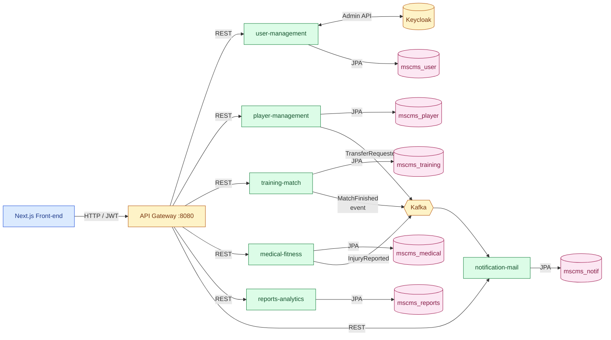

---

## 2. Class diagram — Player & Team domain

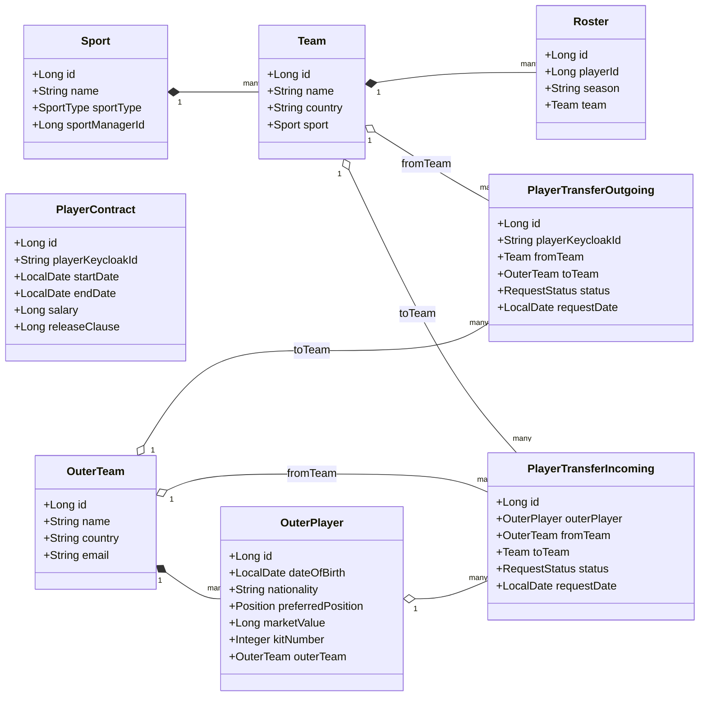

---

## 3. Class diagram — Match & Training domain

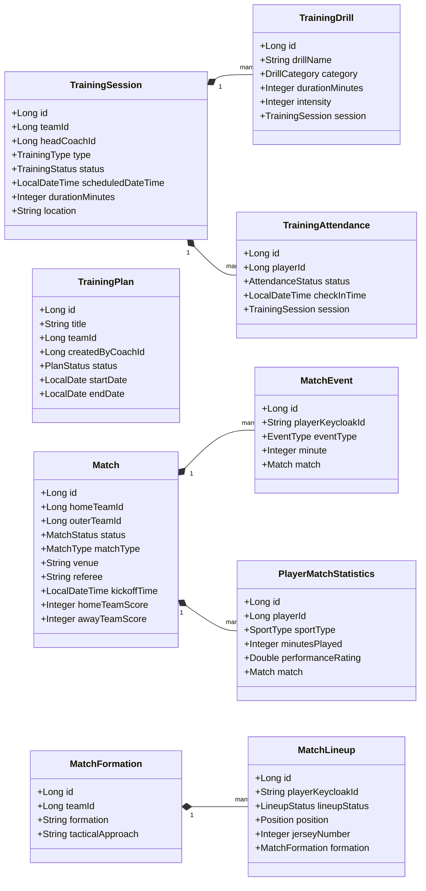

---

## 4. Class diagram — Medical domain

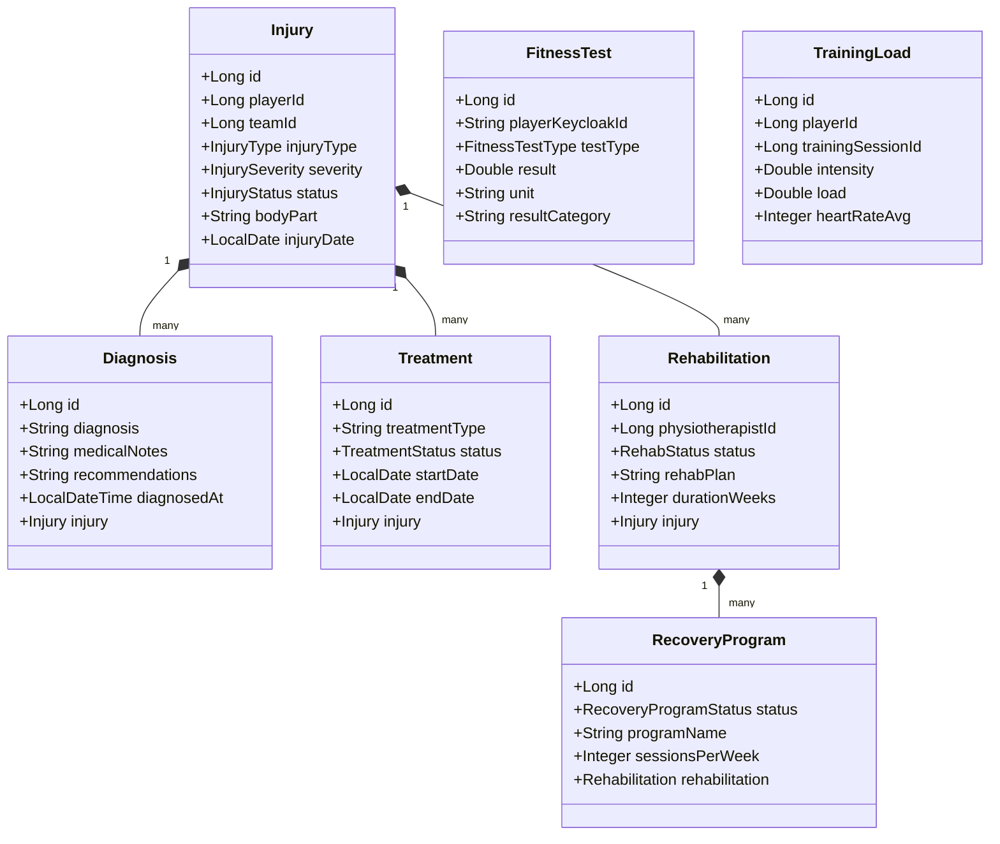

---

## 5. Activity: User signup (fan self-registration)

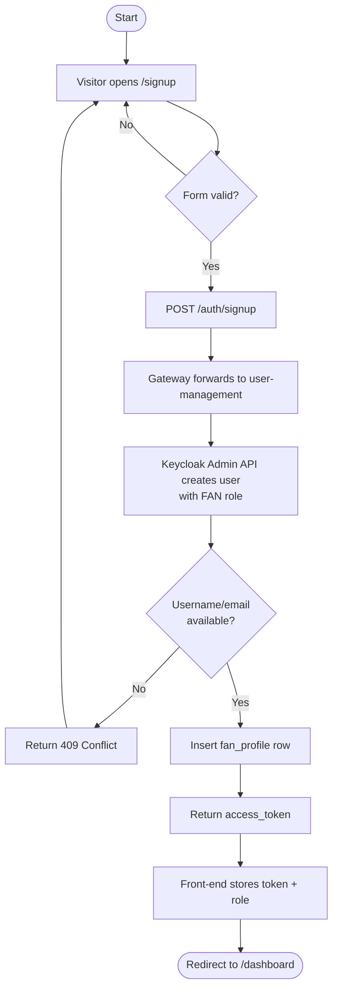

---

## 6. Activity: Player rating prediction

```mermaid
flowchart TD
    A([Start]) --> B[Coach types player name]
    B --> C{Name in<br/>KNOWN_PLAYERS list?}
    C -- Suggest --> D[Autocomplete fills field]
    C -- Free text --> E[User submits anyway]
    D --> F[Click Evaluate]
    E --> F
    F --> G[GET /ml-proxy/player/predict/&#123;name&#125;]
    G --> H[Next.js rewrites to<br/>http://ml-player-rating:8000]
    H --> I[FastAPI loads<br/>Football_Players_Data.csv]
    I --> J{Player name<br/>matches row?}
    J -- No --> K[Return 404<br/>'Player not found'] --> L([Show error with suggestions])
    J -- Yes --> M[Build feature vector<br/>34 numeric + 2 categorical]
    M --> N[Predict via joblib regression]
    N --> O[Return rating + name + position]
    O --> P([Render headline + breakdown bars])
```

---

## 7. State diagram — Notification life cycle

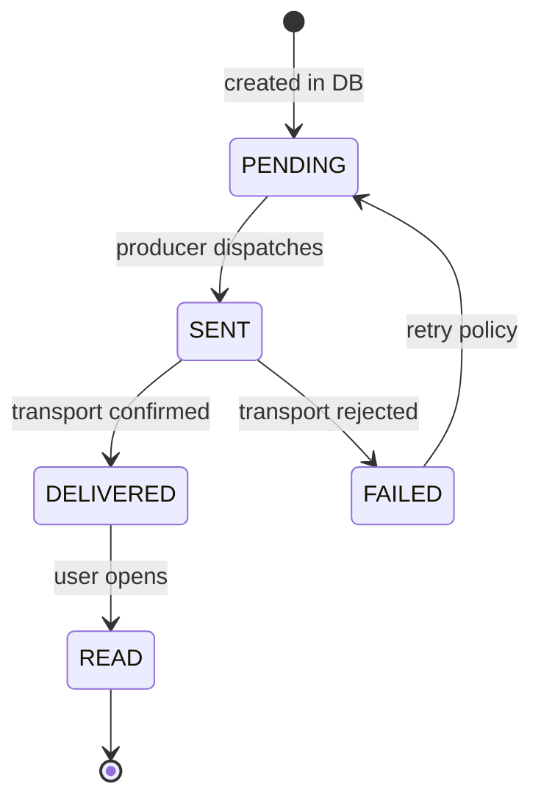

---

## 8. State diagram — Alert life cycle

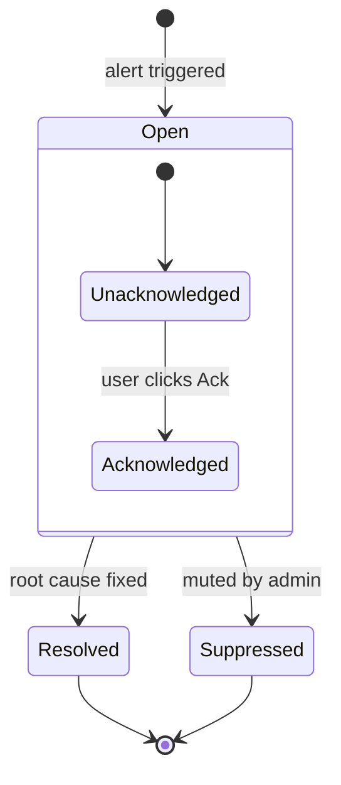

---

## 9. Gantt — Recommended sprint plan

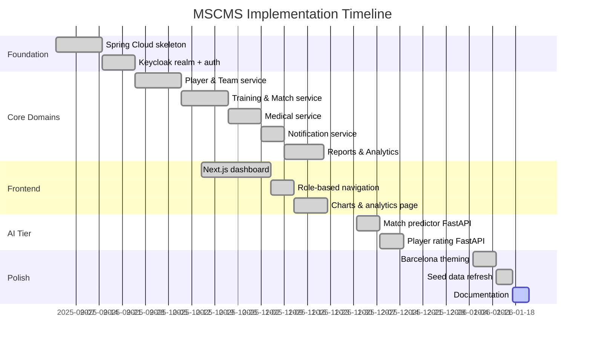

---

## 10. Pie — Roles distribution in the seed

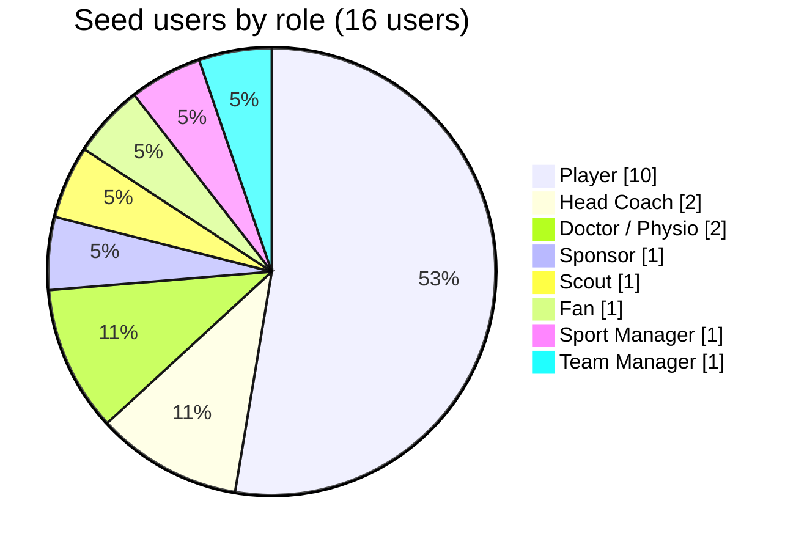

---

## 11. ER (focused) — Reports analytics aggregation

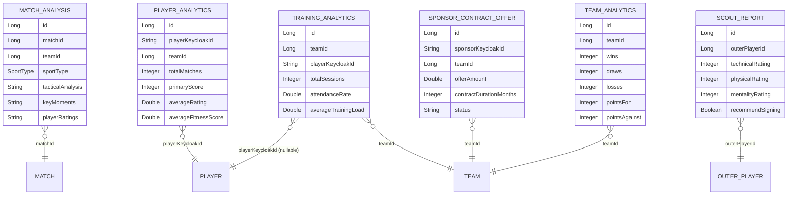

---

## 12. Journey — A Coach's typical day in MSCMS

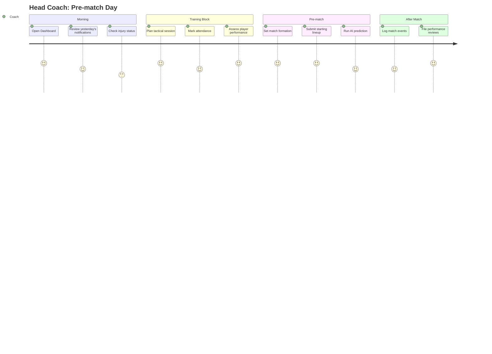
