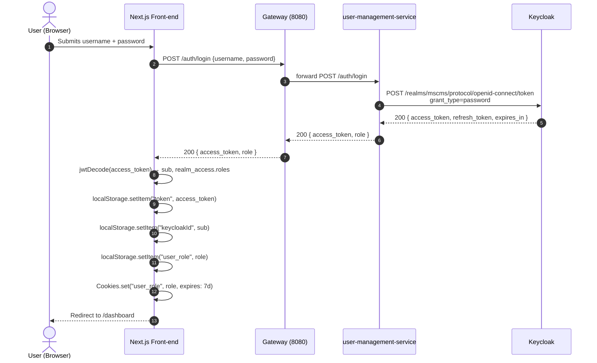
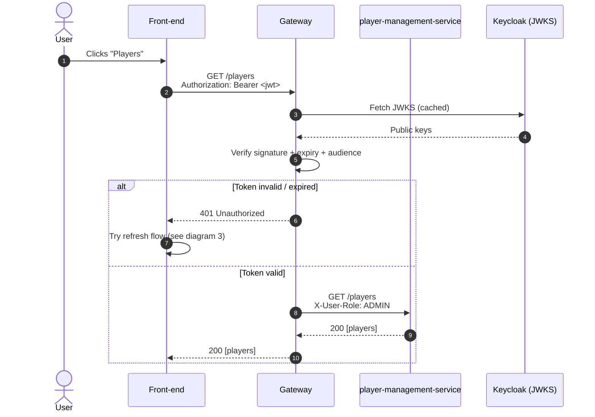
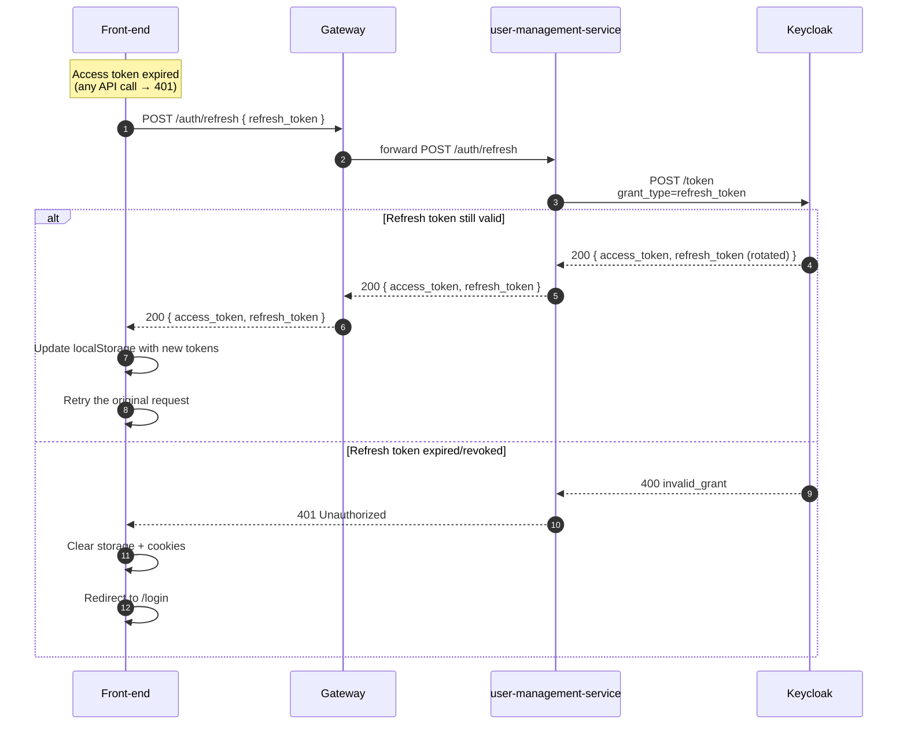
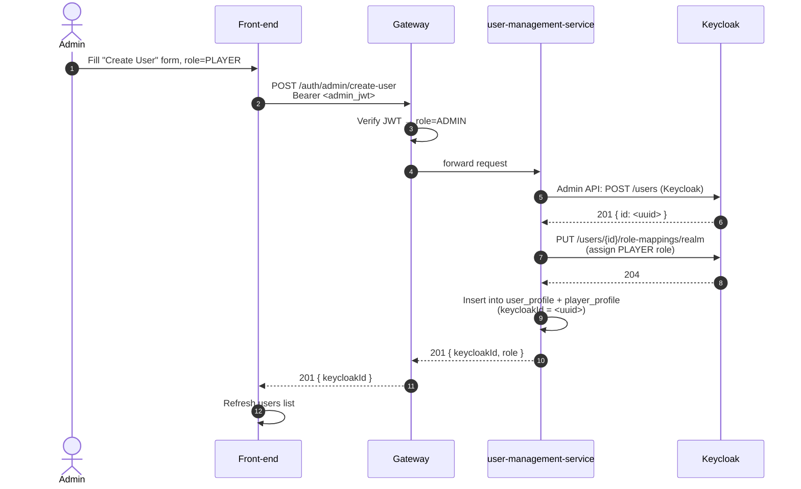
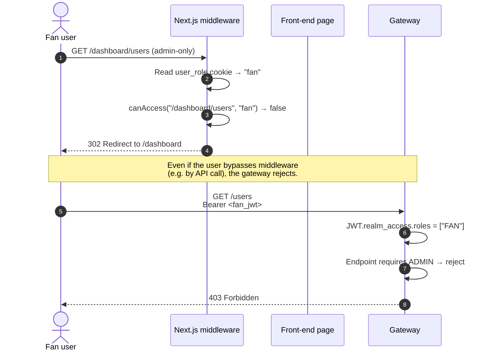

# Authentication Sequence Diagrams (Mermaid)

This file contains Mermaid source for the MSCMS authentication flow. To
render to SVG/PNG you can use the official Mermaid CLI:

```bash
npm i -g @mermaid-js/mermaid-cli
mmdc -i AUTH_SEQUENCE.md -o auth.png
```

Or paste the snippets into <https://mermaid.live>.

---

## 1. Login flow (password grant)



---

## 2. Authenticated request to a microservice



---

## 3. Refresh-token flow (transparent re-auth)



---

## 4. Admin creates a new user



---

## 5. Role-based access denial (middleware)


