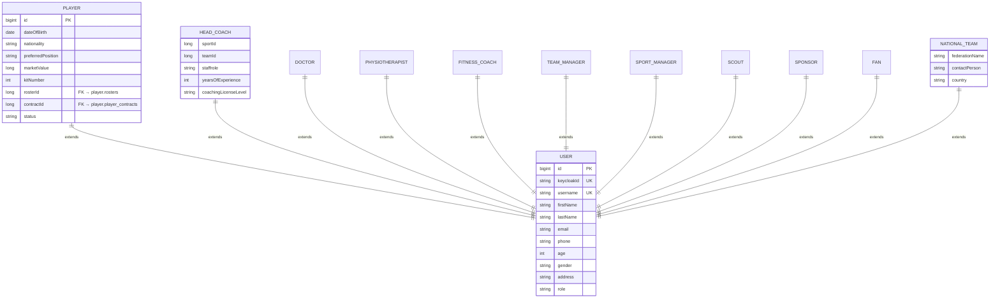
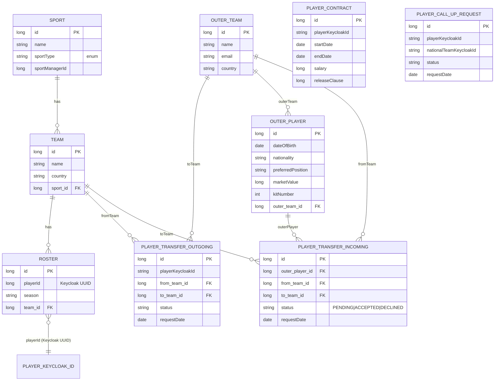
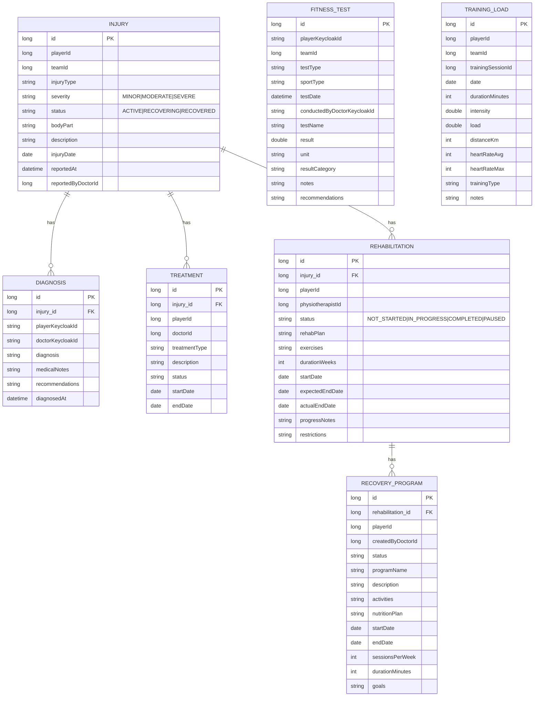
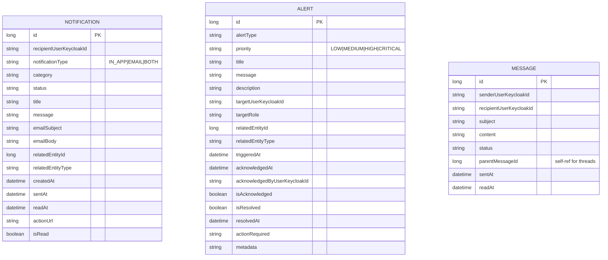

# MSCMS Entity-Relationship Diagram

The full schema spans **6 PostgreSQL databases**, one per Java microservice.
Cross-database references are by string `keycloakId` or numeric domain IDs
(no physical foreign keys cross database boundaries).

Render with: `mmdc -i ER_DIAGRAM.md -o er.png`
or paste into <https://mermaid.live>.

---

## Database: `mscms_user` (user-management-service)

---

## Database: `mscms_player` (player-management-service)

---

## Database: `mscms_training` (training-match-service)

```mermaid
erDiagram
    TRAINING_SESSION ||--o{ TRAINING_DRILL : has
    TRAINING_SESSION ||--o{ TRAINING_ATTENDANCE : has
    TRAINING_SESSION ||--o{ PLAYER_TRAINING_ASSESSMENT : has
    MATCH ||--o{ MATCH_EVENT : has
    MATCH ||--o{ MATCH_PERFORMANCE_REVIEW : has
    MATCH ||--o{ PLAYER_MATCH_STATISTICS : has
    MATCH_FORMATION ||--o{ MATCH_LINEUP : has

    TRAINING_SESSION {
        long id PK
        long teamId
        long headCoachId
        string trainingType
        string status
        datetime scheduledDateTime
        int durationMinutes
        string location
        string objectives
        string notes
    }
    TRAINING_PLAN {
        long id PK
        string title
        string description
        long teamId
        long createdByCoachId
        date startDate
        date endDate
        string status
        string goals
        string focus
    }
    TRAINING_DRILL {
        long id PK
        long training_session_id FK
        string drillName
        string category
        int durationMinutes
        int orderInSession
        int intensity
        string equipment
        string instructions
    }
    TRAINING_ATTENDANCE {
        long id PK
        long playerId
        long training_session_id FK
        string status "PRESENT|ABSENT|LATE|EXCUSED|INJURED"
        datetime checkInTime
        string absenceReason
    }
    PLAYER_TRAINING_ASSESSMENT {
        long id PK
        long training_session_id FK
        long playerId
        long assessedByCoachId
        int performanceRating "1-10"
        int effortRating
        int attitudeRating
        string condition
        string strengths
        string areasForImprovement
        string coachComments
    }
    MATCH {
        long id PK
        long homeTeamId
        long outerTeamId
        string matchType
        string status
        string sportType
        string venue
        string competition
        string season
        int homeTeamScore
        int awayTeamScore
        datetime kickoffTime
        datetime finishTime
        string referee
        int attendance
        string matchSummary
    }
    MATCH_FORMATION {
        long id PK
        long teamId
        string setByCoachKeycloakId
        string formation "e.g. 4-3-3"
        string tacticalApproach
        string formationDetails
    }
    MATCH_LINEUP {
        long id PK
        long teamId
        string playerKeycloakId
        long match_formation_id FK
        string lineupStatus "STARTING_11|SUBSTITUTE|RESERVE"
        string position
        int jerseyNumber
        boolean wasSubstituted
        int substitutionMinute
    }
    MATCH_EVENT {
        long id PK
        long match_id FK
        string playerKeycloakId
        long teamId
        string eventType
        int minute
        int extraTime
        string description
    }
    MATCH_PERFORMANCE_REVIEW {
        long id PK
        long match_id FK
        long reviewedByCoachId
        long playerId
        string tacticalAnalysis
        string strengths
        string weaknesses
        string areasForImprovement
        int overallPerformanceRating
    }
    PLAYER_MATCH_STATISTICS {
        long id PK
        long match_id FK
        long playerId
        string sportType
        int minutesPlayed
        double performanceRating
        "+ sport-specific columns: goals, assists, rebounds, ..."
    }
```

---

## Database: `mscms_medical` (medical-fitness-service)

---

## Database: `mscms_reports` (reports-analytics-service)

```mermaid
erDiagram
    MATCH_ANALYSIS {
        long id PK
        long matchId
        long teamId
        string sportType
        string sportSpecificStats "JSON"
        string keyMoments
        string tacticalAnalysis
        string playerRatings "JSON"
        string analyzedByUserKeycloakId
        datetime analyzedAt
        string notes
    }
    PLAYER_ANALYTICS {
        long id PK
        string playerKeycloakId
        long teamId
        string sportType
        date periodStart
        date periodEnd
        int totalMatches
        int primaryScore "goals|points|sets"
        int secondaryScore "assists|rebounds|aces"
        double averageRating
        int totalTrainingSessions
        int attendanceRate
        int currentInjuries
        double averageFitnessScore
        int fitnessTestsCount
        string sportSpecificStats "JSON"
        datetime calculatedAt
    }
    TEAM_ANALYTICS {
        long id PK
        long teamId
        string sportType
        date periodStart
        date periodEnd
        int totalMatches
        int wins
        int draws
        int losses
        int pointsFor
        int pointsAgainst
        double averageTeamFitnessScore
        int totalInjuries
        int totalTrainingSessions
        string kpiData "JSON"
        string sportSpecificStats "JSON"
        string trends "JSON"
    }
    TRAINING_ANALYTICS {
        long id PK
        long teamId
        string playerKeycloakId "nullable, team-wide if null"
        date periodStart
        date periodEnd
        int totalSessions
        int attendedSessions
        int missedSessions
        double attendanceRate
        double averageTrainingLoad
        double averagePerformanceScore
        int injuriesDuringPeriod
        string kpiData
        string trends
    }
    SCOUT_REPORT {
        long id PK
        string scoutKeycloakId
        long outerPlayerId
        int technicalRating "1-10"
        int physicalRating
        int tacticalRating
        int mentalityRating
        string strengths
        string weaknesses
        string overallAssessment
        boolean recommendSigning
        datetime createdAt
    }
    SPONSOR_CONTRACT_OFFER {
        long id PK
        string sponsorKeycloakId
        long teamId
        double offerAmount
        int contractDurationMonths
        string terms
        string status "PENDING|ACCEPTED|REJECTED|EXPIRED"
        datetime offeredAt
        datetime respondedAt
        string notes
    }
```

---

## Database: `mscms_notification` (notification-mail-service)

